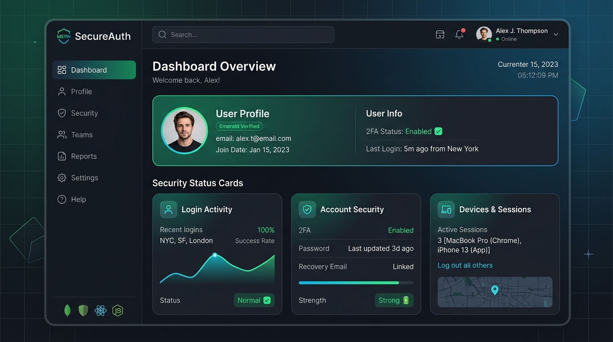

# 🛡️ Secure MERN Stack Authentication System

[](https://nodejs.org)
[](https://expressjs.com)
[](https://react.dev)
[](https://mongodb.com)
[](https://vitejs.dev)
[](https://jestjs.io)
[](LICENSE)

A modern, highly secure, full-stack authentication system built with the MERN stack (**MongoDB, Express, React 19, Node.js**). Features dual-token JWT security (`HttpOnly` cookies), unauthenticated & authenticated 6-digit email verification, transactional Brevo emails, Zod input validation, automated Jest unit & integration testing, and Vercel Serverless deployment configuration.

---

## 🎨 Preview



---

## ✨ Key Features

- **🔐 Dual Token Authentication**: Short-lived `accessToken` and long-lived `refreshToken` stored in `HttpOnly`, `SameSite: lax` cookies protecting against XSS & CSRF.
- **📩 Flexible Email Verification**: 6-digit verification codes sent via Brevo API. Supports verification both from active sessions or across different devices/browsers using registered email fallback.
- **🔑 Session Revocation (`tokenVersion`)**: Updating or resetting a password instantly invalidates all active sessions across all logged-in devices.
- **✉️ Transactional Email Flows**: Integrates with [Brevo](https://www.brevo.com) to automatically deliver verification codes, welcome emails, password reset links, and security alerts. Dev console logging fallback included when API keys are unconfigured.
- **🛡️ Rate Limiting & Security Hardening**: Protection against brute-force attacks via `authRateLimiter` and `verifyRateLimiter`, with automatic fallback between Redis and in-memory stores. Features `helmet` headers and HTML input escaping.
- **⚙️ Strict Input Validation**: Server-side request body parsing powered by **Zod** schemas.
- **🧪 100% Passing Test Suite**: 24 unit and integration test cases built with **Jest**, **Supertest**, and **Babel ESM transpilation**.
- **☁️ Production-Ready Vercel Hosting**: Root `vercel.json` configured for Express Serverless Functions and React SPA static asset routing.

---

## 🛠️ Tech Stack

### Backend
*   **Runtime & Framework**: Node.js, Express v5
*   **Database**: MongoDB, Mongoose v9 (with sparse indexing)
*   **Security**: BcryptJS, JSON Web Tokens (JWT), Cookie-Parser, Helmet
*   **Validation & Rate Limiting**: Zod, Redis / Memory store rate limiters
*   **Mailing**: `@getbrevo/brevo` API SDK
*   **Testing**: Jest v30, Supertest, Babel Core (ES Modules support)

### Frontend
*   **Framework & Build Tool**: React 19, Vite v7
*   **Styling & Icons**: Tailwind CSS v4, Lucide React
*   **Animation & UI**: Framer Motion, React Hot Toast
*   **State Management**: Zustand
*   **HTTP Client**: Axios with automatic `401` refresh interceptors

---

## 📂 Project Structure

```text
MERN_Auth/
├── backend/
│   ├── __tests__/            # Jest unit and endpoint integration tests
│   ├── config/               # DB connection & environment variable validator
│   ├── controller/           # Authentication endpoints logic
│   ├── email/                # Brevo API setup, templates & email sender logic
│   ├── middleware/           # authMiddleware, optionalAuth, rateLimiter, Zod validator
│   ├── model/                # Mongoose User schema with sparse token indexes
│   ├── route/                # Express auth route definitions
│   ├── util/                 # Token helpers, password schemas & HTML escaping
│   ├── app.js                # Express app configuration (serverless ready)
│   └── index.js              # Server boot entry point
├── frontend/
│   ├── src/
│   │   ├── component/        # Form Inputs, PasswordStrengthMeter, FloatingShapes
│   │   ├── pages/            # Login, Signup, VerifyEmail, Forget/ResetPassword, Home
│   │   ├── store/            # Zustand global state (authStore.js)
│   │   └── util/             # Axios instance, validation regexes & date formatters
│   ├── vite.config.js        # Vite bundler configuration
│   └── package.json          # Client dependencies
├── docs/
│   └── mern_auth_preview.jpg # Application UI preview mockup
├── vercel.json               # Monorepo Vercel serverless deployment config
├── .babelrc                  # Babel ES Module transpilation config for Jest
└── package.json              # Backend dependencies & script runner
```

---

## ⚙️ Getting Started

### 1. Prerequisites
- Node.js (v18 or higher recommended)
- MongoDB instance (local or MongoDB Atlas cluster)
- Free [Brevo](https://www.brevo.com) Account (for transactional email delivery)

### 2. Environment Variables Setup

Copy `.env.example` to `.env` in the root directory:

```bash
cp .env.example .env
```

Configure your `.env` variables:

```env
# Server Config
PORT=5000
NODE_ENV=development
CLIENT_URL=http://localhost:5173

# Database & Security
MONGODB_URI=mongodb+srv://<username>:<password>@cluster.mongodb.net/mern-auth-db
ACCESS_TOKEN_SECRET=your_super_secret_access_key
REFRESH_TOKEN_SECRET=your_super_secret_refresh_key
ACCESS_TOKEN_EXPIRY=12h
REFRESH_TOKEN_EXPIRY=7d

# Brevo Email Configuration
BREVO_API_KEY=xkeysib-your_brevo_api_key
SENDER_EMAIL=your-verified-email@domain.com
SENDER_NAME=MERN Auth

# Optional Redis Store (for distributed rate limiting)
REDIS_URL=redis://127.0.0.1:6379
```

*Note: In development mode, if `BREVO_API_KEY` is not provided, verification codes are logged directly to the server terminal console so testing is never blocked.*

---

## 💻 Installation & Running

### Install Dependencies
```bash
# Installs root dependencies and triggers nested frontend dependencies install
npm run build
```

### Start Development Mode
```bash
# Terminal 1: Backend Express server (http://localhost:5000)
npm run dev

# Terminal 2: Frontend Vite server (http://localhost:5173)
cd frontend
npm run dev
```

---

## 📡 API Reference

| Method | Endpoint | Auth Required | Description |
| :--- | :--- | :--- | :--- |
| `GET` | `/api/health` | No | System & MongoDB connection health check |
| `POST` | `/api/auth/signup` | No | Register new user & dispatch verification email |
| `POST` | `/api/auth/login` | No | Authenticate user & issue HttpOnly JWT cookies |
| `POST` | `/api/auth/logout` | Optional | Log out user & clear auth cookies |
| `POST` | `/api/auth/verifyEmail` | Optional | Verify 6-digit email code (session or email input) |
| `POST` | `/api/auth/resendVerification` | Optional | Resend a fresh 6-digit verification code |
| `POST` | `/api/auth/forgetPassword` | No | Dispatch password reset link via email |
| `POST` | `/api/auth/resetPassword/:token` | No | Set new password using reset token |
| `POST` | `/api/auth/changePassword` | Yes | Change password while logged in |
| `GET` | `/api/auth/refreshServer` | Yes | Fetch authenticated user details |
| `POST` | `/api/auth/refresh` | Cookie | Generate new access token using refresh token |

---

## 🧪 Automated Testing

The project uses **Jest**, **Supertest**, and **Babel** for complete coverage of middleware, controller logic, and HTTP endpoints.

```bash
# Run unit and integration tests
npm test
```

### Test Suites Included:
- `authMiddleware.test.js`: Validates JWT verification, cookie extraction, and expired token rejections.
- `authController.test.js`: Validates login, logout, and token versioning.
- `integration.test.js`: Validates end-to-end signup, login, validation schemas, and cookie header sets via Supertest.

---

## ☁️ Vercel Serverless Deployment

This repository includes a preconfigured [vercel.json](file:///D:/MERN_Stack_Journey/MERN_Auth/vercel.json) for single-click deployment:

1. Import your repository into **Vercel**.
2. Add your environment variables in the Vercel Project Settings.
3. Deploy! Vercel automatically routes `/api/*` requests to the Express Serverless Function (`@vercel/node`) and serves the React SPA statically from `frontend/dist` with client-side fallback.

---

## 📜 License

This project is licensed under the [ISC License](LICENSE).
